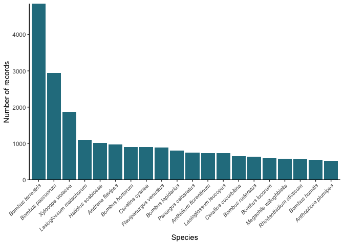
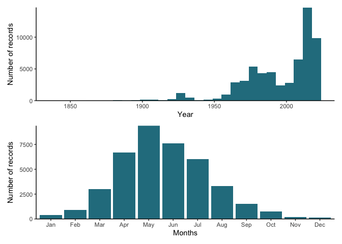

Summary of the Iberian Bees Database
================
I. Bartomeus, T. Wood, L. Carvalheiro, C. Molina, et al. -
24 May, 2020

The Iberian Bee Database contains 65117 entries of bee occurrences over
the peninsula and nearby islands. We have at least one record of 932
species out of the 1055 species known to occurr in the area.

We retained only valid, updated species names. All records have
accompaining metadata on where and when it was collected, and on who
collected, identified and curated the data. We are still reciving and
cleaning data, but we aim to publish the open database after summer.

Here we present a summary of the database:

## Where are the records?

We have records all over the peninsula, but higer concentrations are
marked in red.

<!-- -->

## Which are the most reported species?

Here we show the top-20 most abundant species excluding *Apis
mellifera*.

<!-- -->

## When are we recording more bees?

<!-- -->

<!-- -->

## Who make this posible?

This is a large collaborative effort lead by I. Bartomeus, L.
Carvalheiro and T. Woods, but it would not be possible without the
contribution of thousends of researchers. Those are the main
contributors, but more contributors will be joining soon\!

    ##  [1] "Alejandro Núñez"            "Amparo Lázaro"             
    ##  [3] "Ana Montero-Castaño"        "Anna Traveset"             
    ##  [5] "Blanca Arroyo-Correa"       "C. Heras"                  
    ##  [7] "Curro Molina"               "C. O’Connor"               
    ##  [9] "Concepción Ornosa"          "C. Pérez-Iñigo Mora"       
    ## [11] "Carlos Lara-Romero"         "T. Wood"                   
    ## [13] "D. Paredes"                 "D. Romero"                 
    ## [15] "David Alomar"               "F. Javier Ortiz-Sánchez"   
    ## [17] "F. López-Núñez"             "F. Perfectti"              
    ## [19] "Félix Torres"               "H. Gaspar"                 
    ## [21] "Ignasi Bartomeus"           "Isabel María Liberal"      
    ## [23] "J. Ascher"                  "J. Banaszak"               
    ## [25] "J. Bosch"                   "J. Dusmet"                 
    ## [27] "J. Gonzalez-Varo"           "J. L. Blanco-Pastor"       
    ## [29] "J. Loureiro"                "J. R. Obeso"               
    ## [31] "J.A. González"              "J.D. Alche"                
    ## [33] "J.D. Asís"                  "J.M. Gómez"                
    ## [35] "Javier Herrera"             "Javier Morente-López"      
    ## [37] "Joana Costa"                "José Iriondo"              
    ## [39] "Jose Luis Blanco-Pastor"    "Juan Arroyo"               
    ## [41] "L. Castro"                  "Luis Navarro"              
    ## [43] "M. Campos"                  "M. Miñarro"                
    ## [45] "M. Porcel"                  "M.D. Martínez"             
    ## [47] "M.J. Dardón"                "M.L. Fernández"            
    ## [49] "Montserrat Vilà"            "Manuel Baena"              
    ## [51] "Marina Alonso Solano"       "Mario Fernández-Mazuecos"  
    ## [53] "Carlos Martínez-Núñez"      "Miguel A. González-Estévez"
    ## [55] "Pablo Vargas"               "Pedro Coello"              
    ## [57] "Pilar de la Rúa"            "R. Alcalá"                 
    ## [59] "R. Carvalho"                "R. Heleno"                 
    ## [61] "P.J. Rey"                   "S. Castro"                 
    ## [63] "S.F. Gayubo"                "Victoria Ferrero"          
    ## [65] "Volker Haeseler"

The list of co-authors is not exhaustive, and we did not carefully
checked contributor names yet. Contact <nacho.bartomeus@gmail.com> if
you want to contribute.
