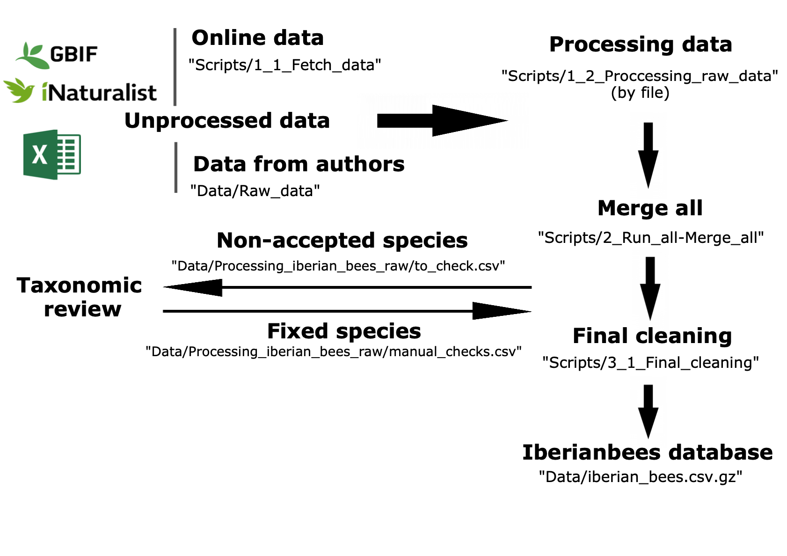

# IberianBees database v.0.3.0 :bee:

This is a work in progress repository to document the distribution and diversity of bee species of the Iberian Peninsula. You can see a summary of the data [here](https://github.com/ibartomeus/IberianBees/blob/Jose_cleaning/Manuscript/Summary/Summary.pdf).   

## How to use this repo  

- The Iberiabees database can be found on: `Data/iberian_bees.csv.gz`. This is a zip file so double click on it to unzip.

- Records with non-accepted names on the Iberian bee species masterlist have been excluded of the final dataset but can be found on `Data/Processing_iberian_bees_raw/removed.csv`. 

- The excluded species will be checked manually with special help of Thomas Wood and added to `Data/Processing_iberian_bees_raw/manual_checks.csv` that after running `Scripts_3_1_Final_cleaning.R` will update the database with the corrected record.

- Please, if you spot any issue or you want to clean this data further, please let @ibartomeus know to avoid duplicating efforts by creating an [issue](https://github.com/ibartomeus/IberianBees/issues) with the corresponding unique identifier (uid) of the record that needs to be fixed.

- If you are curious on the process keep reading.

# Process:

1- Use `Scripts/1_1_Fetch_data.R` to update data from internet (i.e. Gbif, iNaturalist).

2- Add new datasets (i.e. csv files) locally to `Data/Rawdata/csvs/`.

3- Process and clean individual files and assign a unique identifier within the folder `Scripts/1_2_Processing_raw_data/`.

4- Run `Scripts/2_Run_all-Merge_all.R`. This will run all individual files in `Scripts/1_2_Processing_raw_data/`and bind the data. The data can be merged directly without running all files by running the second section of the code "2 Merge all files".

5- Conduct a final cleaning (things that weren't fixed on the individual files on step 3). This is done in `Scripts/3_1_Final_cleaning.R` and will generate the final dataset `Data/iberian_bees.csv.gz`.

5.1- Non accepted species are excluded and saved on `Data/Processing_iberian_bees_raw/removed.csv`. 

5.2- The non-accepted species names (e.g., synonyms) are checked manually from `Data/Processing_iberian_bees_raw/to_check.csv` and added to `Data/Processing_iberian_bees_raw/manual_checks.csv` once they have been reviewed with taxonomic advice when necessary.  After running `Scripts/3_1_Final_cleaning.R` the fixed species will be included on the final Iberianbees dataset.

