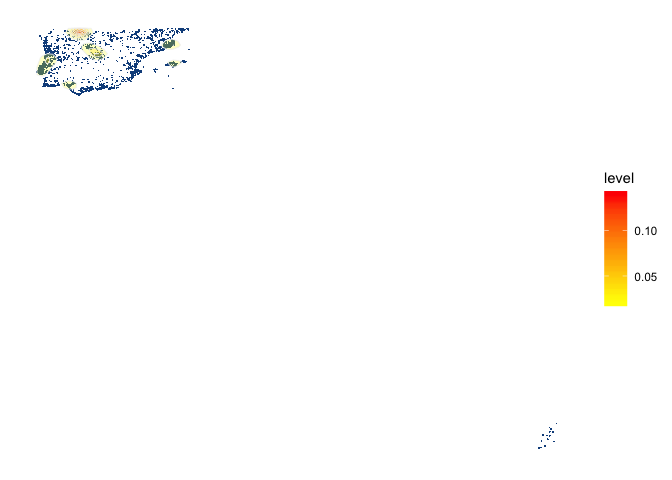
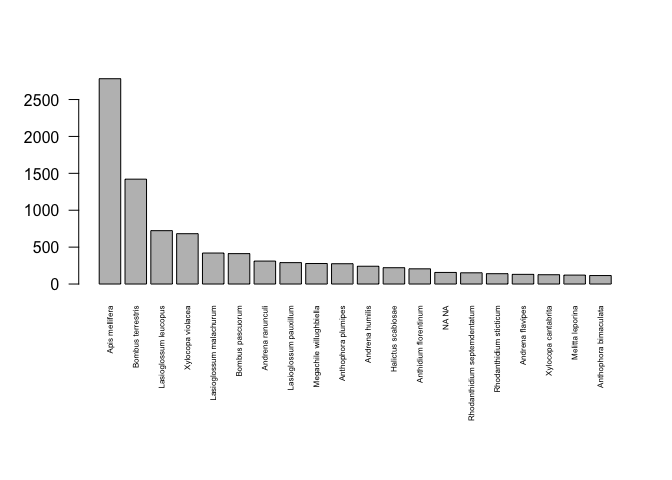
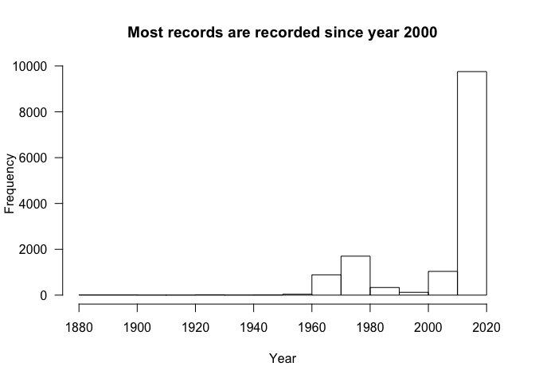

Summary
================
I. Bartomeus
4/12/2020

# Iberian Bee Database.

The Iberian Bee Database contains 17290 entries of bee occurrences over
the peninsula and nearby islands. We have at least one record of 935
species out of the 1100? species known to ocurr in the area. Here we
present a summary of the data base:

## Where are the records?

    ## Loading required package: sp

    ## rgdal: version: 1.4-8, (SVN revision 845)
    ##  Geospatial Data Abstraction Library extensions to R successfully loaded
    ##  Loaded GDAL runtime: GDAL 2.4.2, released 2019/06/28
    ##  Path to GDAL shared files: /Users/ibartomeus_air/Library/R/3.6/library/rgdal/gdal
    ##  GDAL binary built with GEOS: FALSE 
    ##  Loaded PROJ.4 runtime: Rel. 5.2.0, September 15th, 2018, [PJ_VERSION: 520]
    ##  Path to PROJ.4 shared files: /Users/ibartomeus_air/Library/R/3.6/library/rgdal/proj
    ##  Linking to sp version: 1.3-2

    ## rgeos version: 0.5-2, (SVN revision 621)
    ##  GEOS runtime version: 3.7.2-CAPI-1.11.2 
    ##  Linking to sp version: 1.3-1 
    ##  Polygon checking: TRUE

    ## Checking rgeos availability: TRUE

    ## Warning: Removed 215 rows containing non-finite values (stat_density2d).

    ## Warning: Removed 215 rows containing missing values (geom_point).

<!-- -->

## Which are the most reported species?

Here we show the top-20 incidence (number of times apearing) per species
excluding *Apis mellifera*

<!-- -->

## Who make this posible?

This is a large collaborative effort lead by… Those are the main
contributors.

<!-- -->
