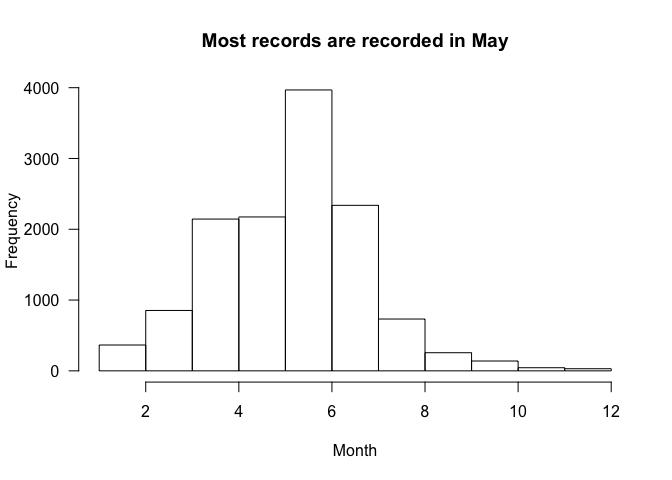
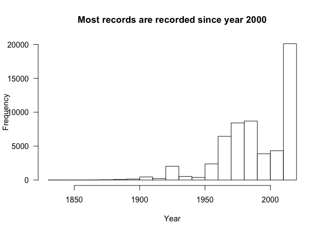

Summary of the Iberian Bees Database
================
I. Bartomeus, T. Wood, L. Carvalheiro et al.
15 May, 2020

The Iberian Bee Database contains 65132 entries of bee occurrences over
the peninsula and nearby islands. We have at least one record of 934
species out of the 1041 species known to occurr in the area. Here we
present a summary of the database:

## Where are the records?

We have records all over the peninsula, but higer concentrations are
marked in red.
<!-- -->

## Which are the most reported species?

Here we show the top-20 most abundant species excluding *Apis
mellifera*.

<!-- -->

## When are we recording more bees?

<!-- --><!-- -->

## Who make this posible?

This is a large collaborative effort lead by I. Bartomeus, L.
Carvalheiro and T. Woods, but it would not be possible without the
contribution of thousends of researchers. Those are the main
contributors (this can be prettier and more data is in the pipeline).

<!-- -->
